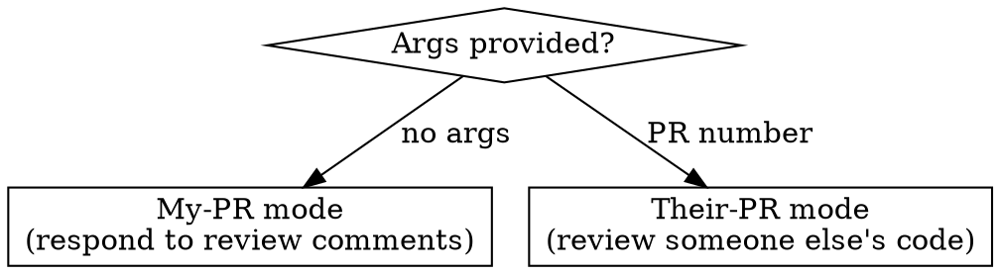

# Review PR

Handle both sides of PR review: responding to feedback on your own PR, or reviewing someone else's code.

## Mode Detection



- **No args** — current branch's PR. You're the author responding to review comments.
- **PR number as arg** — someone else's PR. You're the reviewer.

## Iron Law

```
NEVER push to remote
NEVER submit a review or reply without user approval via AskUserQuestion
NEVER evaluate a comment without reading the actual source code first
NEVER use performative agreement ("Great catch!", "Good eye!", "Nice find!")
NEVER fabricate line numbers or file paths — verify every reference against the source
```

---

## My-PR Mode (no args)

Respond to review comments on your own PR — fix what's right, rebut what's wrong.

**REQUIRED BACKGROUND:** Follow superpowers:receiving-code-review principles. Technical rigor, not performative agreement.

### Step 1: Identify the PR

1. Run `gh pr view --json number,url` to get the PR number and URL from the current branch.
2. Run `gh repo view --json nameWithOwner` to get owner/repo.
3. If no PR exists on the current branch, stop and tell the user.

### Step 2: Fetch review threads

Use `mcp__github__pull_request_read` with method `get_review_comments` to fetch all review threads.

Filter to **unresolved** threads only. Skip resolved and outdated threads.

### Step 3: Evaluate each comment

For each unresolved comment:

1. **Read the source file** at the referenced lines using the Read tool. Never evaluate a comment from the diff alone — you need full file context.
2. **Assess technical merit.** Is the reviewer's concern valid? Consider:
   - Does the suggestion actually improve correctness, security, or clarity?
   - Is the reviewer missing context that changes the picture?
   - Is this a style preference vs a real issue?
3. **Decide: fix or rebut.** No middle ground — either the comment warrants a code change or it doesn't.

### Step 4: Present plan to user

Use `AskUserQuestion` to show your assessment of ALL comments at once. For each comment, show:
- The reviewer's comment (quoted, abbreviated if long)
- Your verdict: **fix** or **rebut**
- Your reasoning (one or two sentences)

Wait for user approval before proceeding. User may override any verdict.

### Step 5: Execute

For each comment, based on the approved verdict:

**If fixing:**
1. Make the code change.
2. Commit with a conventional commit message (use `/conventional-commit` workflow if multiple fixes warrant it, or just commit directly for small changes).
3. Reply to the comment via `mcp__github__add_reply_to_pull_request_comment` explaining what was changed. Lead with the fix, not with praise.

**If rebutting:**
1. Reply via `mcp__github__add_reply_to_pull_request_comment` with a technical explanation of why the current approach is preferred. Lead with the reason.

---

## Their-PR Mode (with PR number)

Review someone else's code. Produce a thorough, well-organized review.

### Step 1: Gather context

1. Parse the PR number from args.
2. Get owner/repo via `gh repo view --json nameWithOwner`.
3. Fetch PR details via `mcp__github__pull_request_read`:
   - method `get` — title, description, base/head branches
   - method `get_diff` — the full diff
   - method `get_files` — list of changed files

### Step 2: Read source files

For every file in the diff, read the **full source file** (not just the diff hunk) using the Read tool. You need surrounding context to evaluate changes properly — a diff hunk in isolation is misleading.

For large PRs (10+ files), prioritize:
1. Core logic files (handlers, services, models)
2. Files with the most changes
3. New files
4. Test files
5. Config/boilerplate last

### Step 3: Analyze

Review with this priority order:

1. **Correctness** — Does the code do what it claims? Edge cases? Off-by-one errors? Race conditions?
2. **Security** — Injection, auth bypass, sensitive data exposure, input validation at system boundaries?
3. **Design** — Does this fit the existing architecture? Are abstractions appropriate or premature?
4. **Consistency** — Does it follow the project's existing patterns and conventions?
5. **Readability** — Would another developer understand this without asking questions?

### Step 4: Draft review comments

For each issue found, draft an inline comment with:

- **Severity tag** at the start: `[must-fix]`, `[should-fix]`, or `[nit]`
- **Problem first** — state what's wrong or concerning
- **Then the suggestion** — what to do about it
- Include a code suggestion in a fenced block when the fix is concrete

Determine the overall review event:
- `REQUEST_CHANGES` if any `[must-fix]` comments exist
- `COMMENT` if only `[should-fix]` or `[nit]` comments
- `APPROVE` if no issues found (rare — say why you're confident)

### Step 5: Present draft to user

Use `AskUserQuestion` to show:
- The overall event type you recommend
- Each comment with its severity, file, line, and text
- A summary body for the review (2-3 sentences covering the overall impression)

Wait for approval. User may edit, remove, or add comments.

### Step 6: Submit review

Use the pending review workflow:

1. `mcp__github__pull_request_review_write` with method `create` (no `event` parameter) — creates a pending review.
2. For each approved comment, call `mcp__github__add_comment_to_pending_review` with the file path, line number, side (`RIGHT` for new code), and comment body.
3. `mcp__github__pull_request_review_write` with method `submit_pending`, passing the `event` and `body`.

### Step 7: Re-request Copilot review (if applicable)

After submitting, check if Copilot previously reviewed this PR:
```bash
gh api repos/{owner}/{repo}/pulls/{number}/reviews --jq '.[].user.login' | grep -q 'copilot-pull-request-reviewer\[bot\]'
```
If so, re-request it so Copilot reviews the latest changes:
```bash
gh api repos/{owner}/{repo}/pulls/{number}/requested_reviewers -X POST --input - <<< '{"reviewers":["copilot-pull-request-reviewer[bot]"]}'
```
Skip silently if Copilot has not previously reviewed the PR.

---

## Writing Style

- Sound like a developer talking to a teammate. Natural, not robotic.
- Em dashes are fine. Markdown formatting encouraged — headers, bold, code blocks, lists.
- No emojis.
- Be concise. Say what needs saying, then stop.
- **When rebutting:** lead with the technical reason, not with softeners.
- **When reviewing:** state the problem first, then the suggestion.
- **When replying after a fix:** say what was changed and why. Don't thank the reviewer performatively.

## Integration

- Pairs with `/edit-pr` (create/update PRs) and `/conventional-commit` (commit changes).
- Depends on `gh` CLI being authenticated and GitHub MCP tools being available.
- Does NOT push branches. Use `/conventional-commit` for that.
